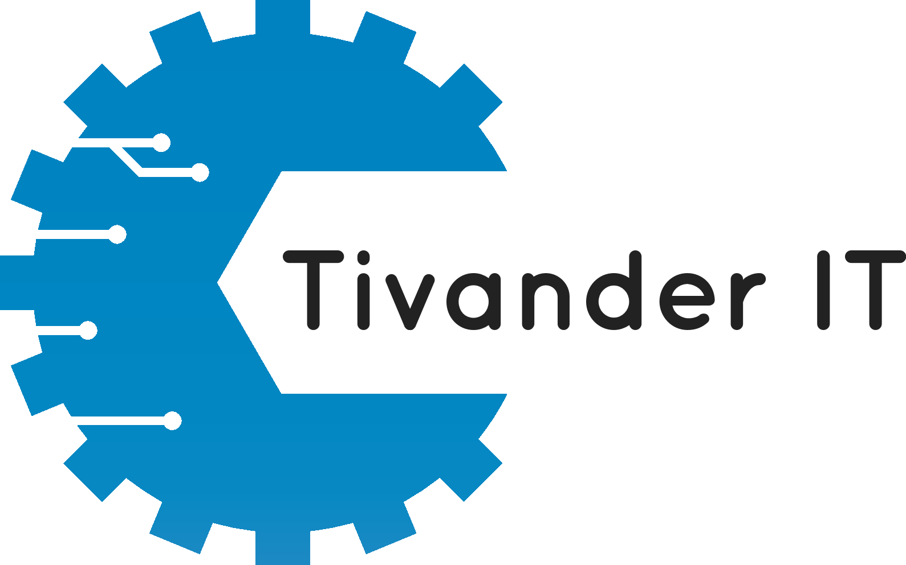

# Tivander IT AB - Official Website & Code Showcase

Welcome to the official repository for the Tivander IT AB website. This project serves a dual purpose: it's our company's online presence and, equally important, a transparent showcase of the high-quality code and modern development practices we offer to our clients. We believe in demonstrating our capabilities, and this project is a testament to the standards, stability, and security you can expect when partnering with Tivander IT.

---
## A Glimpse into Our Quality Standards

We believe that the quality of a software product is a direct reflection of the engineering practices behind it. This project showcases several advanced techniques and tools we leverage to build robust, secure, and maintainable solutions.

### 1. Comprehensive End-to-End Testing

To ensure reliability and a seamless user experience across different environments, we employ rigorous end-to-end (E2E) testing.

*   **Cross-Browser Compatibility:** Our tests are configured to run against major browser engines (Chromium, Firefox, WebKit), guaranteeing that the application behaves consistently for all users.
*   **Progressive Enhancement Testing:** We test critical functionalities, like the contact form, with **both JavaScript enabled and disabled**. This validates our commitment to progressive enhancement, ensuring that core features are accessible even without client-side scripting, while users with modern browsers get an enhanced interactive experience.

### 2. Advanced Contact Form: WASM & Progressive Enhancement

Our contact form is a prime example of leveraging modern web technologies for performance and resilience.

*   **WebAssembly (WASM) for Interactivity:** The interactive elements of the contact form (real-time validation, dynamic feedback) are built using Leptos components compiled to **WebAssembly (WASM)**. This allows for near-native performance for client-side logic.
*   **Graceful Degradation:** For users with JavaScript disabled, the form remains fully functional. It falls back to standard HTML form submission, with validation and feedback handled server-side. This ensures everyone can reach us.
*   **Dual Validation:** Robust validation is implemented both on the **client-side (via WASM)** for immediate feedback and on the **server-side** as a crucial security and data integrity measure.

### 3. High-Performance SSR with an Islands Architecture

The website is built using **Server-Side Rendering (SSR)** with the Leptos framework, incorporating an **islands architecture** for optimal performance.

*   **Fast Initial Load Times:** Most of the application is rendered on the server, sending near-static HTML to the browser. This significantly improves perceived performance and Largest Contentful Paint (LCP) scores.
*   **SEO Benefits:** SSR ensures that all content is readily available to search engine crawlers, enhancing SEO.
*   **Minimal Client-Side Workload:** The "islands" approach means that only specific, interactive components (like the contact form) are hydrated on the client-side (as WASM). The rest of the page remains static HTML, reducing the amount of JavaScript/WASM shipped to the user.

### 4. Declarative & Reproducible Environments with Nix Flakes

Consistency across development, testing, and production is paramount. We achieve this using **Nix Flakes**. The `flake.nix` file at the root of this project defines:

*   **`devShell`:** A reproducible development environment with all dependencies (Rust, Node.js, Playwright, `sqlx-cli`, etc.) pinned to specific versions. This eliminates "works on my machine" issues.
*   **`vm-test`:** A complete NixOS Virtual Machine configuration. This VM mirrors the production environment and is used for running end-to-end tests, ensuring that tests are executed in a clean, consistent, and **truly production-like setting**.
*   **`nixosModule`:** A NixOS module for deploying the application. This module defines how the application runs as a system service, including user setup, networking, and security hardening options (e.g., `ProtectSystem`, `PrivateTmp`).

**Benefits:** This declarative approach guarantees that the same software versions and configurations are used everywhere, simplifies rollbacks, and makes the entire development-to-deployment pipeline highly reliable.

### 5. Database Migrations

We use `sqlx-cli` for managing database schema changes. Migrations are applied automatically on application startup, ensuring the database schema is always in the correct state.

## Project Setup and Usage

This project is built using Rust with the Leptos framework and is packaged using Nix Flakes for reproducible environments.

### Prerequisites

*   **Nix:** You must have Nix installed on your system with Flakes support enabled. Please refer to the [official Nix installation guide](https://nixos.org/download.html) and [how to enable Flakes](https://nixos.wiki/wiki/Flakes#Enable_flakes).

### 1. Local Development Environment

To start developing, enter the Nix development shell:

```bash
nix develop
```

This command will:
*   Download and make available all pinned dependencies specified in `flake.nix`, including the correct Rust toolchain, `cargo-leptos`, `playwright-test`, `sqlx-cli`, and more.
*   Set up necessary environment variables for development. Key variables include:
    *   `LEPTOS_OUTPUT_NAME`: "tivanderit-web"
    *   `LEPTOS_SITE_ROOT`: "target/site" (where frontend assets are built)
    *   `LEPTOS_SITE_ADDR`: "127.0.0.1:3000" (default address for the dev server)
    *   `LEPTOS_RELOAD_PORT`: "3001" (for hot reloading)
    *   `DATABASE_URL`: "sqlite:tivanderit-dev.db" (local SQLite database file)
    *   `MIGRATIONS_PATH`: "./migrations" (path to database migration files)
    *   `PLAYWRIGHT_BROWSERS_PATH`: Points to the Playwright browser binaries managed by Nix. It also sets `PLAYWRIGHT_SKIP_VALIDATE_HOST_REQUIREMENTS=true` to simplify Playwright setup within the Nix environment.

**Common Development Commands (run inside `nix develop`):**

*   **Start the development server with hot reloading:**
    ```bash
    cargo leptos watch
    ```
    The website will be available at `http://127.0.0.1:3000`.

*   **Build the application (development mode):**
    ```bash
    cargo leptos build
    ```

*   **Format Leptos code:**
    ```bash
    leptosfmt .
    ```

*   **Check the project (compilation and static analysis):**
    ```bash
    cargo check --features ssr
    ```

### 2. Database Setup & Migrations

The application uses SQLite as its database.

*   **Automatic Migrations:** Database migrations (located in the `./migrations` directory) are automatically applied when the application starts up (both via `cargo leptos watch` and in the production build). The development database file is `tivanderit-dev.db`.
*   **Manual Database Interaction:** The `sqlx-cli` tool is available in the development shell if you need to interact with the database manually:
    ```bash
    # Example: List migrations
    sqlx migrate info
    # Example: Connect to the dev database
    sqlite3 tivanderit-dev.db
    ```

### 3. Running End-to-End Tests

End-to-end tests are written using Playwright and are located in the `end2end/` directory.

*   **Run tests against the local development server:**
        ```bash
        cargo leptos end-to-end
        ```
        (Note: `PLAYWRIGHT_BROWSERS_PATH` is set by the Nix shell, so Playwright will use the browsers downloaded by Nix.)

*   **Run tests in a dedicated Test VM (Recommended for CI/CD):**
    The `flake.nix` provides a NixOS VM configuration (`vm-test`) that replicates a production-like environment. This is ideal for ensuring tests run reliably.
    *  Build and run the test VM in headless mode: *Nix need a 'x86_64-linux' builder for this to work*
        ```bash
        nix run .#vm-test
        ```
        This will start the VM in headless mode. The application server within the VM will be accessible at `http://localhost:8080` on your host machine (port 8080 on the host is forwarded to port 80 in the VM where Caddy serves the site).
        To run tests against the VM:
        a. Start the VM: `nix run .#vm-test`
        b. In your `end2end/playwright.config.ts`, temporarily change the `baseURL` to `http://localhost:8080`.
        c. Run Playwright tests as usual from your host: `cd end2end && playwright test`
        d. Remember to revert the `baseURL` change after testing against the VM.

### 4. Building for Production

To build the production-ready package (as defined in `flake.nix`):

```bash
nix build .
```
This will create a `./result` directory (symlink) containing the compiled server binary, frontend assets, and migrations. This is what the NixOS module uses for deployment. The `./result` symlink is a standard output location for `nix build`.
** Run it **
```bash
./result/bin/tivanderit
```

---
**© 2024-2025 Tivander IT AB. All rights reserved.**

This source code is proprietary and confidential. Unauthorized copying, modification, distribution, or use of this code, or any part thereof, is strictly prohibited.
